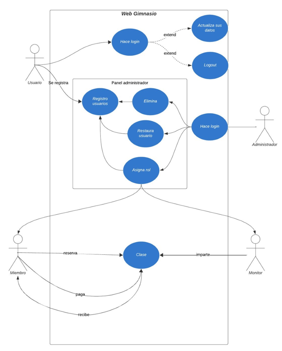
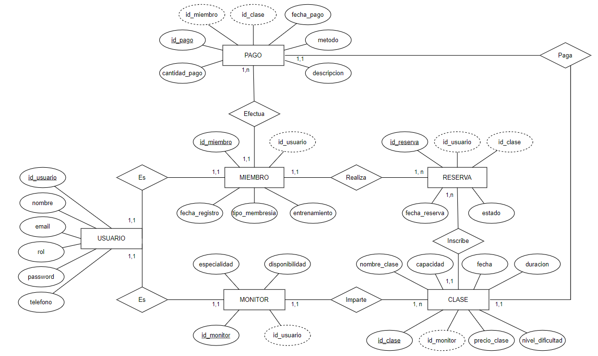

## Índice
- [1. Introducción](#introduccion) 						 
- [2. Objetivos](#objetivos)  												  
- [3. Tecnologías y herramientas escogidas](#tecnologias_escogidas)  						       	   	  
  - [3.1. Lenguajes de programación](#lenguajes_programacion)  			          	     		  
  - [3.2. Bases de datos](#bases_datos)   						    		  
  - [3.3. Servidor de aplicaciones](#servidor_aplicaciones)  						    		  
- [4. Diseño de la aplicación](#diseno)  										  
  - [4.1. Casos de uso](#casos_uso) 								     	  
  - [4.2. Diagrama E-R](#diagrama)  						    	  						  
- [5. Arquitectura de la aplicación](#arquitectura)   						         	   		 
- [6. Manual de instalación](#manual)
     - [6.1. Requisitos de Hardware y Software](#requisitos)
     - [6.2. Instalación de XAMPP](#instalacion)
     - [6.3. Configuración](#configuracion)
     - [6.4. Comprobación](#comprobacion)

<a name="introduccion"></a>
## 1. Introducción 	
El proyecto consiste en el desarrollo de una plataforma web de gestión de gimnasio destinada a facilitar el acceso al ejercicio físico mediante el uso de herramientas digitales.
## 2. Objetivos 
<a name="objetivos"></a>
La razón de la elaboración de este proyecto viene dada por la  la creciente preocupación por la salud y el bienestar físico, especialmente en un contexto donde el sedentarismo es cada vez más común. A nivel técnico, el proyecto tiene como objetivo principal proporcionar funcionalidades útiles y fáciles de usar para los usuarios.
<a name="tecnologias_escogidas"></a>
## 3. Tecnologías y herramientas escogidas
La aplicación dará servicio a distintos tipos distintos de usuarios:
- `Usuarios`: Pueden crear cuentas, iniciar sesión y gestionar su perfil.
- `Administrador`: Es el encargador del mantenimiento general, gestiona usuarios, clases, horarios, monitores, y membresías.
- `Miembros`: Pueden visualizar clases disponibles, apuntarse a ellas, y gestionar su membresía.
- `Monitores`: Pueden gestionar su disponibilidad y consultar sus clases.
<a name="lenguajes_programacion"></a>
### 3.1. Lenguajes de programación
- **PHP**: Se utiliza como el lenguaje de programación principal para el backend.
- **HTML** y **CSS**: Para el desarrollo de la interfaz y el diseño de la página web.
- **JavaScript**: Para gestionar la interacción, validaciones y dinámicas dentro del sistema.
<a name="bases_datos"><a/>
### 3.2. Bases de datos
- **MySQL**: Se utiliza como el sistema de gestión de bases de datos para almacenar la información sobre usuarios, monitores, clases, pagos, etc. La base de datos se gestiona a través de phpMyAdmin.
<a name="servidor_aplicaciones"><a/>
### 3.3. Servidor de aplicaciones
- **XAMPP**: Se utiliza como entorno de desarrollo para ejecutar el sistema en un servidor local. Incluye Apache (servidor web), MySQL (base de datos) y PHP (lenguaje de programación). XAMPP permite crear un entorno de desarrollo accesible y fácil de configurar para el desarrollo de aplicaciones web.
<a name="diseno"><a/>
## 4. Diseño de la aplicación
<a name="casos_uso"><a/>
### 4.1. Casos de uso

<a name="diagrama"><a/>
### 4.2. Diagrama E-R

<a name="arquitectura"><a/>
## 5. Arquitectura de la aplicación
La estructura de la aplicación es la siguiente:
- `Gimnasio`: contiene la página principal de la aplicación.
  - `index.php`: archivo principal que sirve como punto de entrada a la aplicación.
- `assets`: carpeta que almacena los recursos estáticos de la aplicación.
  - `css`: contiene los estilos globales de la aplicación.
  - `imgs`: almacena las imágenes utilizadas en la aplicación.
  - `js`: contiene los archivos JavaScript que manejan la lógica del cliente.
- `sql`: contiene los scripts relacionados con la base de datos.
  - `actividad2_db.sql`: archivo que define la estructura inicial de la base de datos.
  - `import_users_members_monitors.sql`: script para importar usuarios, miembros y monitores.
- `src`: carpeta principal que contiene el código fuente de la aplicación.
  - `admin`: incluye los archivos relacionados con la gestión del administrador.
    - `admin.php`: panel principal del administrador.
    - `admin_functions.php`: funciones específicas para el administrador.
    - `admin_header.php`: encabezado para las páginas del administrador.
    - `edit_admin.php`: permite editar la información del administrador.
    - `notificaciones.php`: gestiona las notificaciones administrativas.
  - `auth`: gestiona la autenticación de usuarios.
    - `log.php`: archivo de logs.
    - `login.php`: página de inicio de sesión.
    - `logout.php`: gestiona el cierre de sesión.
    - `reg.php`, `registro.php`: páginas de registro de usuarios.
  - `clases`: maneja la funcionalidad relacionada con las clases.
    - `clases.php`: página principal para clases.
    - `clases_disponibles.php`: muestra las clases ofertadas por el gimnasio.
    - `clases_monitor.php`: gestiona las clases asignadas a los monitores.
    - `class_functions.php`: funciones relacionadas con las clases.
    - `crear_clase.php`, `editar_clase.php`, `nueva_clase.php`: archivos para la creación y edición de clases.
    - `mis_clases.php`, `mi_clase_functions.php`: gestiona las clases propias de un usuario.
  - `config`: contiene los archivos de configuración.
    - `configuracion.php`: configuración general de la aplicación.
    - `db_connection.php`: archivo para la conexión con la base de datos.
  - `Includes`: archivos comunes utilizados en distintas partes de la aplicación.
    - `footer.php`: pie de página común.
    - `general.php`: funciones generales compartidas.
    - `header.php`: encabezado común.
  - `inicio`: gestiona las páginas iniciales.
    - `about.php`: información sobre el gimnasio.
    - `contacto.php`: página de contacto.
  - `membresias`: incluye los archivos relacionados con las membresías.
    - `crear_membresia.php`: creación de nuevas membresías.
    - `membresias.php`: gestión de membresías.
    - `mi_membresia.php`: visualización y gestión de la membresía de un usuario.
  - `miembros`: funcionalidad para miembros del gimnasio.
    - `edit_miembro.php`: edición de información del miembro.
    - `member_functions.php`: funciones específicas para miembros.
    - `miembro.php`, `miembros.php`: páginas principales de miembros.
    - `miembro_header.php`: encabezado para las páginas de miembros.
    - `mis_notificaciones.php`: gestiona las notificaciones de los miembros.
  - `monitores`: funcionalidades específicas para monitores.
    - `edit_monitor.php`: edición de información del monitor.
    - `monitor.php`, `monitores.php`: páginas principales de monitores.
    - `monitores_header.php`: encabezado para las páginas de monitores.
    - `monitor_functions.php`: funciones específicas para monitores.
    - `notificaciones_monitor.php`: gestiona las notificaciones de los monitores.
  - `pagos`: gestiona los pagos.
    - `pago.php`: página principal de pagos.
    - `proceso_pago.php`: gestiona el procesamiento de pagos.
  - `perfil`: permite la gestión del perfil de los usuarios.
    - `editar_perfil.php`: edición del perfil del usuario.
    - `perfil_functions.php`: funciones relacionadas con el perfil.
  - `usuarios`: funcionalidades generales para los usuarios.
    - `crear_usuario.php`: creación de nuevos usuarios.
    - `edit_usuario.php`: edición de información de los usuarios.
    - `user_functions.php`: funciones específicas para los usuarios.
    - `user_header.php`: encabezado para las páginas de usuarios.
    - `user_membresias.php`: visualización de membresías de un usuario.
    - `user_notificaciones.php`: gestión de notificaciones de usuarios.
    - `usuario.php`, `usuarios.php`: páginas principales de usuarios.
<a name="manual"><a/>
## 6. Manual de instalación
<a name="requisitos"></a>
### 6.1. Requisitos de Hardware y Software
- Memoria RAM: 4 GB mínimo (8 GB recomendados).
- Espacio en disco: 1 GB libre para la aplicación y base de datos.
- Servidor Web: Apache (incluido en XAMPP).
- Base de Datos: MySQL (incluido en XAMPP).
- PHP: Versión 7.4 o superior.
- Navegador: Últimas versiones de Chrome, Firefox o Edge.
<a name="instalacion"></a>
### 6.2. Instalación de XAMPP
1. Descarga XAMPP desde [https://www.apachefriends.org](https://www.apachefriends.org).
2. Durante la instalación, selecciona los siguientes componentes:
   - Apache
   - MySQL
   - PHP
3. Completa la instalación y ejecuta el Panel de Control de XAMPP.
4. Activa los servicios de Apache y MySQL en el Panel de Control de XAMPP.
<a name="configuracion"></a>
### 6.3. Configuración
#### Base de datos
1. Accede a `http://localhost/phpmyadmin` para gestionar la base de datos.
2. Crea una nueva base de datos llamada `gimnasio`.
3. Importa los archivos SQL ubicados en `Gimnasio/sql/`:
   - `actividad2_db.sql`
   - `import_users_members_monitors.sql`
#### Configuración del Proyecto
1. Copia la carpeta del proyecto `Gimnasio` en el directorio `htdocs` de XAMPP:
  - Si deseas usar el nombre específico del proyecto:
     - Ruta típica: `C:\xampp\htdocs\Gimnasio`
   - Si deseas mantener el nombre del repositorio GitHub:
     - Ruta típica: `C:\xampp\htdocs\ProyectoM12`
#### Configuración del Archivo de Conexión a la Base de Datos
1. Abre el archivo `Gimnasio/src/config/db_connection.php`.
2. Configura las credenciales de la base de datos según tu entorno. Por defecto, el archivo contiene lo siguiente:
   ```php
   $servername = "localhost"; 
   $username = "root";         
   $password = "";             
   $dbname = "actividad_02";  
<a name="comprobacion"></a>
## 6.4. Comprobación 
Accede a la aplicación en el navegador con la URL: http://localhost/Gimnasio.
